# Word2Vec from Scratch using NumPy

A complete implementation of Word2Vec (Skip-gram and CBOW) using only NumPy, without relying on deep learning frameworks like PyTorch or TensorFlow.

> This project was developed as part of my application for the JetBrains internship program. 

## Project Structure
```
word2vec/
│
├── src/                        # Core implementation
│   ├── vocab.py               # Vocabulary management
│   ├── skipgram.py            # Skip-gram architecture
│   ├── cbow.py                # CBOW architecture
│   ├── word2vec.py            # Wor2Vec class implementation
│   ├── train.py               # Mani training loop
│   └── utils.py               # Helper functions
│
├── notebooks/                  # .ipynb files
│   └── visualizations.ipynb
│
├── models/                      # Saved trained models
│   ├── skipgram-model.pkl
│   └── cbow-model.pkl
│
├── data/                       # Dataset directory
│   ├── SimLex-999.txt
│   └── text8.txt
│
├── configs/                     # .yaml configuration files
│   ├── cbow_config.yaml 
│   └── skipgram_config.yaml 
│
├── checkpoints/                     # .yaml configuration files
│   ├── cbow/                   # directory of cbow checkpoints
│   └── skipgram/               # directory of skipgram checkpoints
│
├── figures/                      # .png files of plots and tests
│   ├── cbow_analogy.png 
│   ├── cbow_clusters.png 
│   └── ...
│
├── requirements.txt            # Dependencies
└── README.md                   # This file
```

## Quick Start

### Installation

```bash
# Clone the repository
git clone https://github.com/AramayisKhachatryan/word2vec.git
cd word2vec

# Install dependencies
pip install -r requirements.txt
```
## Data
Download the [text8](https://www.kaggle.com/datasets/yorkyong/text8-zip) corpus (first 100MB of Wikipedia) and add it to data folder.
## Configuration
Each model has its own YAML config file like this
```yaml
model:
  type: skipgram                    # or "cbow"
  save_name: skipgram-model
  embedding_dim: 100

training:
  epochs: 4
  learning_rate: 0.1
  window_size: 2
  num_negative_samples: 15

evaluating:
  simlex_path: data/SimLex-999.txt  # evaluation dataset path

vocabulary:
  min_count: 5
  subsample_threshold: 1.0e-5

data:
  corpus_path: data/text8
  output_dir: models/
  checkpoint_dir: checkpoints/skipgram/
  p: 0.25                           # Fraction of corpus to use

wandb:
  enabled: true
  project: word2vec
  log_interval: 100
  eval_log_interval: 50000
```

### Training
```bash
# Skip-gram (default config)
python src/train.py

# With a custom config
python src/train.py --config configs/cbow_config.yaml

# Disable Weights & Biases logging
python src/train.py --no-wandb
```

## Usage
```python
from src.vocab import Vocab
from src.word2vec import Word2Vec

# Prepare your corpus
corpus = "some text data here to train word2vec on"

# Build vocabulary
vocab = Vocab(corpus, min_count=3)

# Define word2vec model
model = Word2Vec(
    vocab=vocab,
    embedding_dim=100,
    epochs=5
)
# Train model
model.train(corpus)

# Save model
model.save_model('models/word2vec.pkl')
```

### Using a Trained Model
```python
from word2vec import Word2Vec

model = Word2Vec.load_model('models/skipgram_model.pkl')

# Get embedding vector
vector = model.get_embedding("king")

# Find most similar words
model.most_similar("king", top_n=10)
```

## Algorithm Details
### Skip-gram Model

Predicts context words given a target word. Works well with rare words.

### CBOW Model

Given a context window, it averages the context word vectors and predicts the center word. Trains faster than Skip-gram model.

### Negative sampling

As described in [Distributed Representations of Words and Phrases and their Compositionality](https://arxiv.org/pdf/1310.4546) (Mikolov et al.), we use negative sampling for training instead of computing the full softmax over the entire vocabulary. We calculate $f(w)$ distribution of words in our corpus and chose $k$ negative samples from $f(w)^{3/4}$.

### Subsampling of Frequent Words
Common words like "the", "a", "in" are randomly discarded. Probability of keeping the word is:

$$
P(keep) = \left(\sqrt{\frac{f}{t}} + 1\right)\frac{t}{f}
$$

where $t$ is a chosen threshold ($10^{-5}$ in our implementation) and $f$ is frequency of the given word.

### Embedding Initialization
Both for Skip-gram and CBOW "in" and "out" embedding vectors are initialized from the uniform distribution in $(-\frac{1}{d}, \frac{1}{d})$ range where $d$ is embedding dimension. Dimension of embeddings is 100.


## Gradient Derivations
### Skip-gram
target word embedding vector - $h$

context word embedding vector - $c$

$j$-th negative sample embedding vector - $n_j$

number of negative samples - $K$
___
$$ L = -\log\sigma(h\cdot c) - \sum_{i=1}^K\log\sigma(-h\cdot n_i)=-\log\sigma(h^T c)- \sum_{i=1}^K\log(1-\sigma(h^T n_i))$$
___
$$
    \frac{\partial  L}{\partial c} = -\frac{1}{\sigma(h^Tc)}\cdot \sigma(h^Tc)(1-\sigma(h^Tc))h + 0=(\sigma(h^Tc)-1)h
$$
___
$$
    \frac{\partial  L}{\partial n_j} = 0-\frac{1}{1-\sigma(h^Tn_j)}\cdot(-\sigma(h^Tn_j))(1-\sigma(h^Tn_j))h=\sigma(h^Tn_j)h
$$
___
$$
    \frac{\partial  L}{\partial h}=-\frac{1}{\sigma(h^Tc)}\cdot \sigma(h^Tc)(1-\sigma(h^Tc))h-\sum_{i=1}^K\frac{1}{1-\sigma(h^Tn_i)}(-\sigma(h^Tn_i))(1-\sigma(h^Tn_i))n_i=
$$

$$
    =(\sigma(h^Tc)-1)h+\sum_{i=1}^K\sigma(h^Tn_i)n_i
$$
___
### CBOW
Gradient derivation for CBOW differs from Skip-gram just by initial definition of vectors.

averaged context word embedding vector - $h$,

$$
h=\frac{1}{2k}\sum_{-k\leq j\leq k, j\neq0}v_{w_{t+j}}
$$

Where $v_{w_{t}}$ is target word, $v_{w_{t+j}}$ are surrounding context words and $k$ is window size.

target word embedding vector - $t$

$j$-th negative sample embedding vector - $n_j$

number of negative samples - $K$
___
$$
         L = \log\sigma(h^T t)- \sum_{i=1}^K\log(1-\sigma(h^T n_i))
$$
___
$$
    \frac{\partial L}{\partial t} = (\sigma(h^T t) - 1)h
$$
___
$$
    \frac{\partial L}{\partial n_j} = \sigma(h^Tn_j)h
$$
___
$$
    \frac{\partial L}{\partial h} = (\sigma(h^Tt)-1)h+\sum_{i=1}^K\sigma(h^Tn_i)n_i
$$
___

## Data
For our training we have used [text8](https://www.kaggle.com/datasets/yorkyong/text8-zip) corpus, a cleaned version of [Wikipedia](https://www.wikipedia.org/) text containing the first 100MB of English Wikipedia. This text consists exclusively of lowercase letters and spaces. 

Due to computational limits our model were trained only on first 5000000 characters of the original data which is approximately equivalent to 850000 words.

## Training

| Model | Window Size | # Negative Samples | Epochs | Learning Rate | Subsample Threshold |
| :--- |:-----------:|:------------------:|:------:|:-------------:| :---: |
|  **Skip-gram** |      2      |         15         | **4**  |   **0.025**   | $10^{-5}$ |
| **CBOW** |      2      |         15         | **10** |   **0.05**    | $10^{-5}$ |

The table above summarizes the training hyperparameters for both models. Number of **epochs** were tuned to provide equal training time of models.
**Learning rate** was chosen according to original paper.
For both models **learning rate** is updated according to this rule:

$$
\alpha = \max \left\( 10^{-5}, \alpha_0 \cdot \frac{\text{processed samples}}{\text{total samples}} \right\)
$$

where $\alpha$ is current learning rate and $\alpha_0$ is initial learning rate.

## Results
|                   Skip-gram                    |                    CBOW                    |
|:----------------------------------------------:|:------------------------------------------:|
|         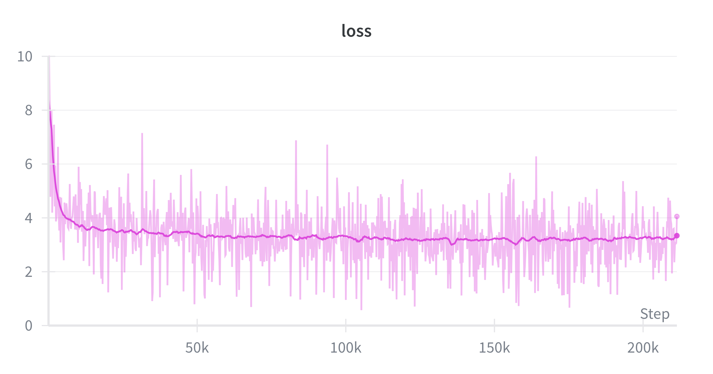         |         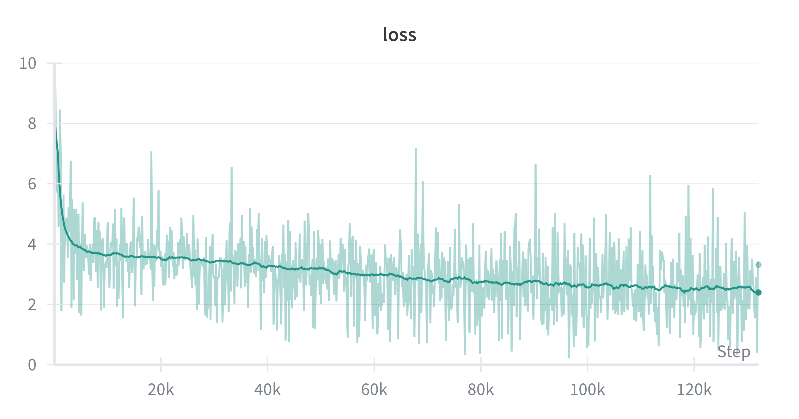         |
|     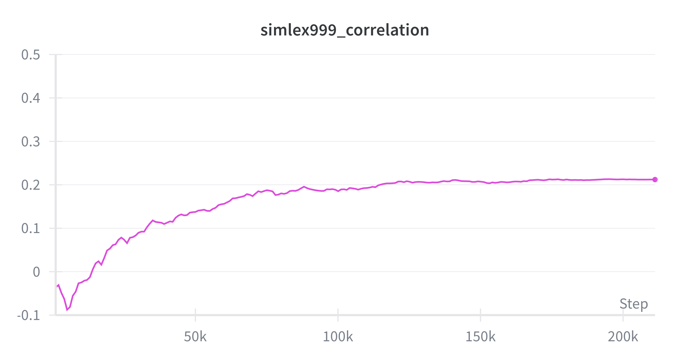      |     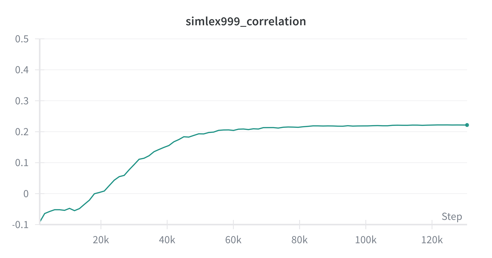      |
|         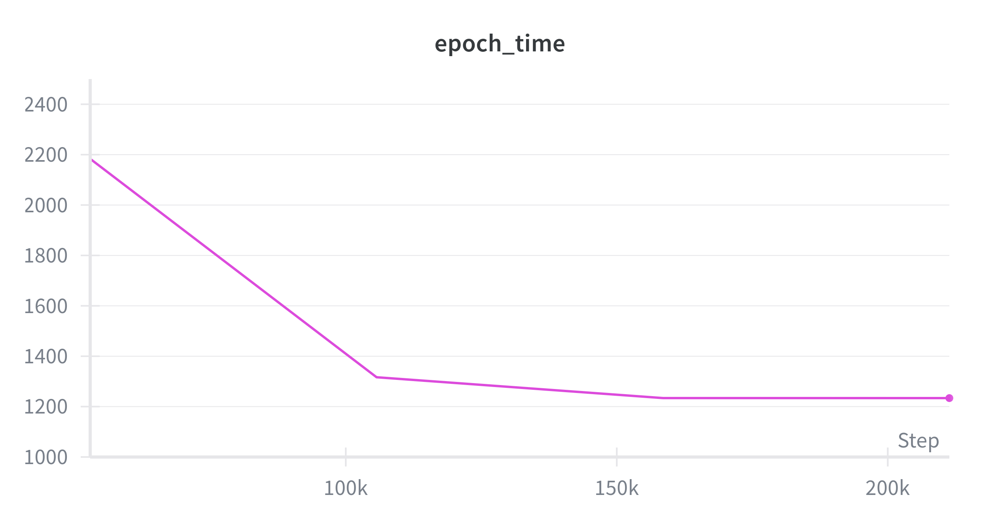         |         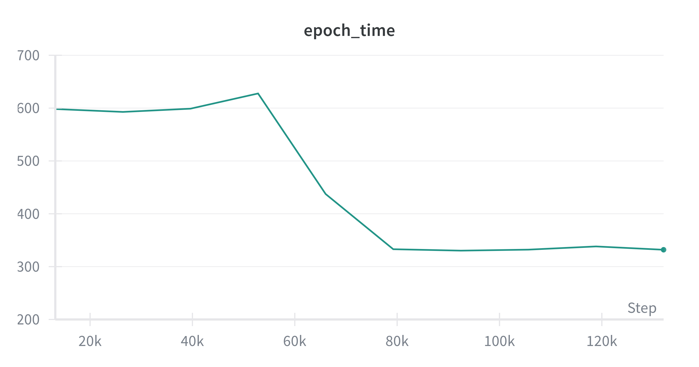         |
|  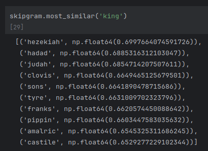   |  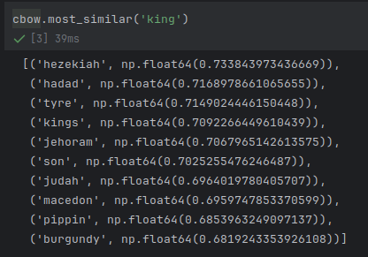   |
| 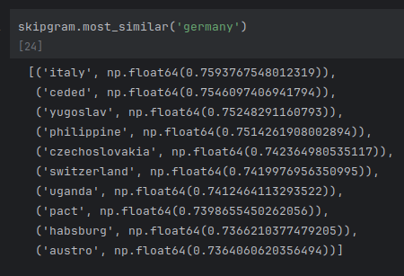 | 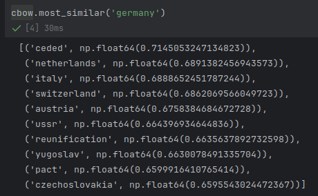 |
| 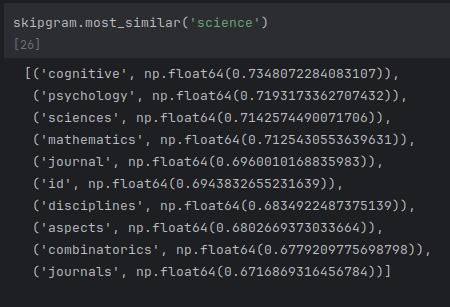 | 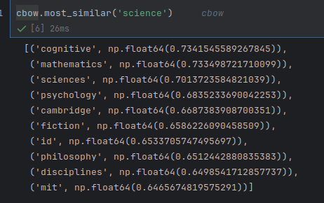 |
|   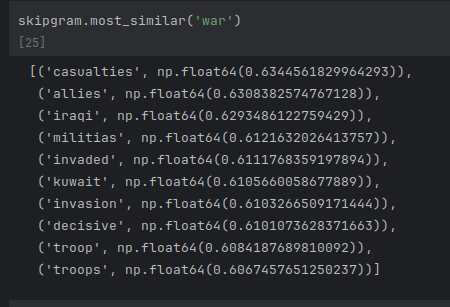   |   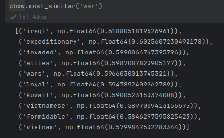   |
|       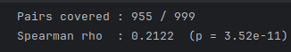       |       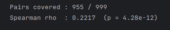       |
|       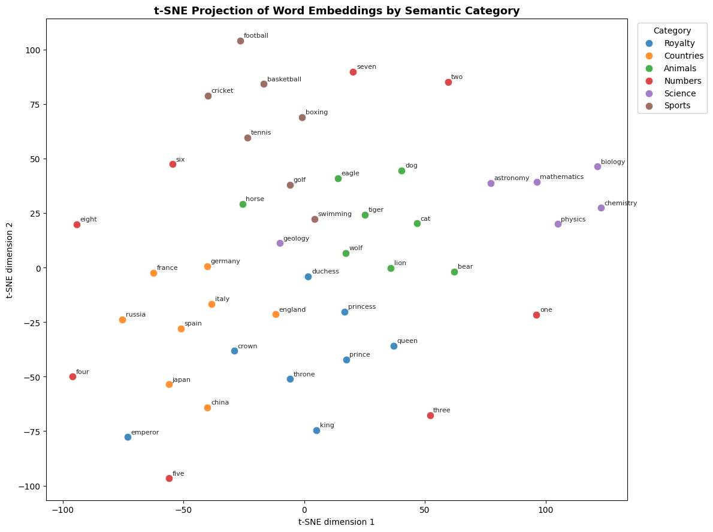       |       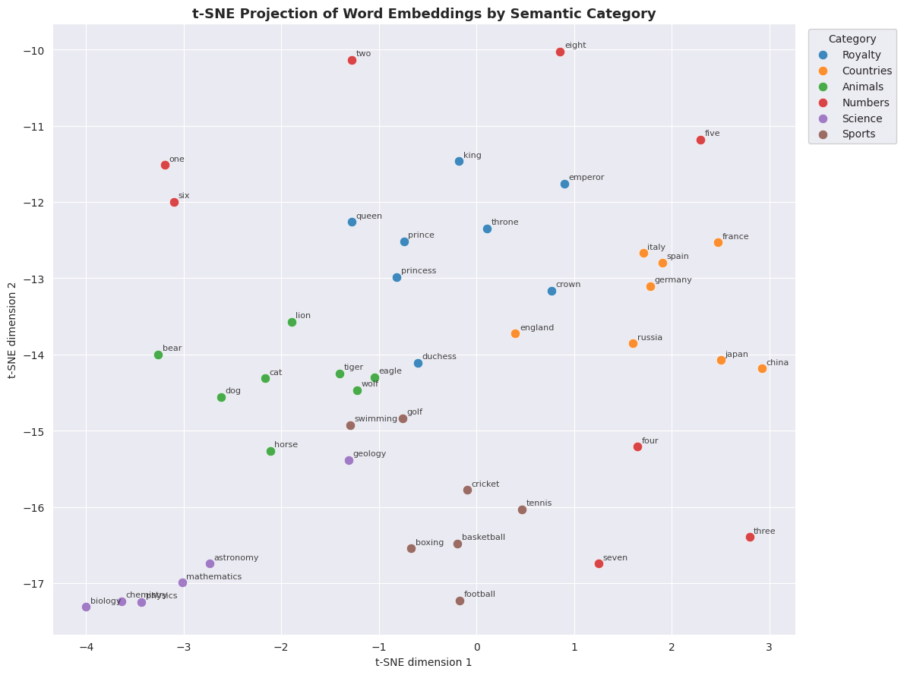       |

Solving word analogy like 'king' - 'man' + 'woman' = 'queen'


Skip-gram
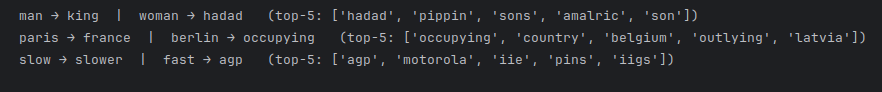


CBOW
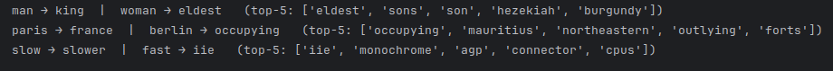

During training, Spearman’s correlation on the validation benchmark improved monotonically.
CBOW performed slightly better than Skip-gram based on Spearman's correlation.
Both models were trained approximately for 90 minutes.

The learned embeddings demonstrate meaningful semantic structure:

- For `king`, both models retrieve historically relevant entities (e.g., biblical and royal figures), reflecting context-driven learning from corpus statistics.
- For `germany`, nearest neighbors predominantly consist of other countries and regions, indicating that geopolitical relationships are encoded in the embedding space.
- The word `science` is surrounded by academic disciplines and research-related terms, emphasizing its scholarly context.
- For `war`, the models capture geopolitical context as well as associated consequences and actions, suggesting that co-occurrence statistics effectively encode thematic structure.

t-SNE projections reveal that CBOW forms more visually coherent and well-separated semantic clusters compared to Skip-gram. However, both models fail to clearly cluster digits.

Finally from analogy solving we can see that both of models return meaningful words but not the expected ones.
It seems that in embedding vector space similar word vectors are close but mathematical expressions like adding or subtracting isn't learned well.

Overall, the results indicate that both architectures successfully capture semantic similarity and thematic structure from distributional statistics. However, learning robust linear relational representations appears to require either larger corpora, additional tuning, or architectural refinements.

## References


[1] - Mikolov, T., et al. (2013). ["Distributed Representations of Words and Phrases and their Compositionality"](https://arxiv.org/pdf/1310.4546) 

[2] - Mikolov, T., et al. (2013). ["Efficient Estimation of Word Representations in Vector Space"](https://arxiv.org/pdf/1301.3781)

[3] - Hill, et al. (2015) — [SimLex-999: Evaluating Semantic Models](https://arxiv.org/pdf/1408.3456)
## Author
**Aramayis Khachatryan**

*Applying for JetBrains Internship Summer/Fall 2026*

- LinkedIn: [Aramayis Khachatryan](https://www.linkedin.com/in/aramayis-khachatryan-730080346/)
- Email: aramayis.d.khachatryan@gmail.com
